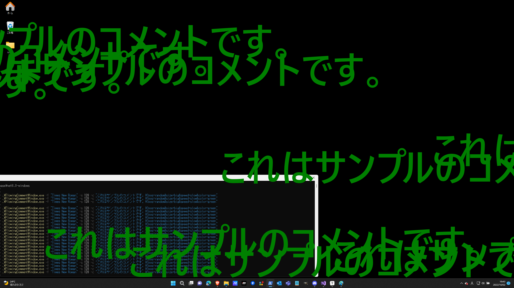

# FlowingCommentWindow

## これはどういうアプリケーション？

### アプリケーションの概要

このアプリケーションをコマンドラインから呼び出す形で実行することで、Windowsの画面上にニコニコ動画のコメントのように文字列を流すことができます。


### 実行イメージ




### 動作環境

Windows11にて動作することを確認してあります。

#### コンパイルに必要な環境

* Visual Studio 2022（またはそれ以降のバージョン）
* .NET Standard 6.0


## 使い方

### コンパイル ＆ 実行用EXEファイルの生成方法

FlowingCommentWindow.slnをVisual Studioで開き、Releaseビルドを行ってください。  
ビルドにより、フォルダ「FlowingCommentWindow\FlowingCommentWindow\bin\Release\net6.0-windows」が生成されます。   
上記フォルダに含まれる「FlowingCommentWindow.exe」をPowerShellのコマンドラインから実行することで、画面上にコメントを流すことができます。


### EXEの実行方法

以下のオプションを指定してEXEを実行します。

| オプション名<br />（省略形） | オプション名<br />（非省略形） | 設定可能な値                 | オプションの意味                                             | 値の例                           | 必須 |
| ---------------------------- | ------------------------------ | ---------------------------- | ------------------------------------------------------------ | -------------------------------- | ---- |
| -c                           | --comment                      | 任意の文字列                 | このオプションで指定された文字列がコメントとして流れます。  <br />後述する方法で修飾を入れ込むことが可能です。 | "これはサンプルのコメントです。" | ○    |
| -f                           | --default-font                 | フォントとして存在する文字列 | コメント内でフォントの指定がなかった場合は、このオプションで指定されたコメントが使用されます。 | "メイリオ"                       |      |
| -s                           | --default-font-size            | 正の数値                     | このオプションで指定された数値が標準のフォントサイズとなります。  <br />指定がなかった場合、標準のフォントサイズは108ptとなります。 | 64                               |      |

**コマンドの例**

```powershell
 .\FlowingCommentWindow.exe -f "Times New Roman" -s 128 -c "これはサンプルのコメントです。"
```


### コメント内に入れ込むことが可能な修飾設定

コメントオプション（-c）の値を以下の形にすることによって、流れるコメントを修飾することが可能です。

`"コメント本文\?{オプション名1}={値}&{オプション名2}={値}&..."`

『\?』の後に記載した内容は、修飾用の設定として解釈されます。  
修飾用の設定として、以下のパラメーターを使用することが可能です。

| パラメーター名 | 設定可能な値                                                 | パラメーターの意味                 | 設定例               |
| -------------- | ------------------------------------------------------------ | ---------------------------------- | -------------------- |
| font           | 任意の文字列<br />※存在しないフォント名が指定された場合は効きません。 | コメントに適用したいフォントの種類 | font=Times New Roman |
| size           | 「big」「medium」「small」のいずれか                         | コメントのサイズ                   | size=small           |
| pos            | 「ue」「naka」「shita」「random」のいずれか                  | コメントを流す縦位置               | pos=shita            |
| speed          | 「fast」「medium」「slow」のいずれか                         | コメントの流れる速さ               | speed=fast           |
| color          | HTMLカラーコードの色名として割り当てられている文字列         | コメントの色                       | color=lightgreen     |

**コマンドの例**

```powershell
 .\FlowingCommentWindow.exe -c "これはサンプルのコメントです。\?font=メイリオ&color=red&size=big"
```
